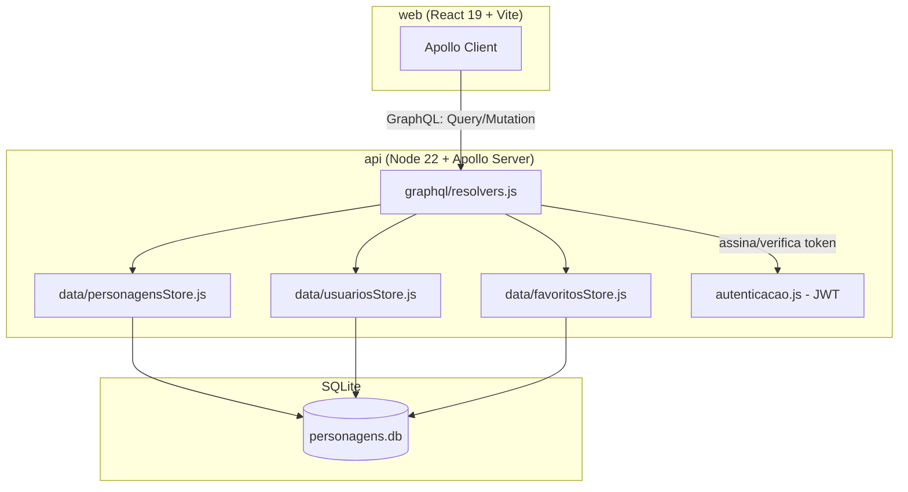
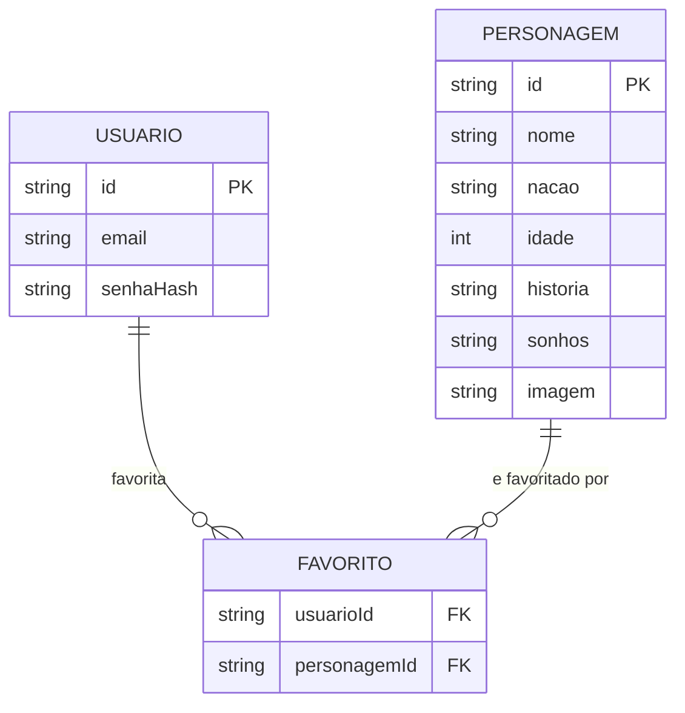

# Wiki de Fãs — Avatar: A Lenda de Aang

Wiki de fãs de *Avatar: A Lenda de Aang* com listagem e página de detalhe dos
personagens via **GraphQL**, mural de lore do mundo (nações, lugares,
celebrações, datas marcantes) e conta de usuário para favoritar personagens.

**Repositório:** [github.com/MarcosRBjunior/Wiki](https://github.com/MarcosRBjunior/Wiki)

---

## Sumário

- [Stack Tecnológica](#stack-tecnológica)
- [Arquitetura](#arquitetura)
- [Modelo de Dados](#modelo-de-dados)
- [Estrutura do Repositório](#estrutura-do-repositório)
- [Endpoints da API (GraphQL)](#endpoints-da-api-graphql)
- [Rotas do Front-end](#rotas-do-front-end)
- [Como Rodar o Projeto](#como-rodar-o-projeto)
- [Variáveis de Ambiente](#variáveis-de-ambiente)
- [Cenários de Teste Manual](#cenários-de-teste-manual)
- [Documentação Complementar](#documentação-complementar)

---

## Stack Tecnológica

| Camada | Tecnologia | Observação |
| --- | --- | --- |
| Back-end | Node.js 22 + Apollo Server 5 | API GraphQL única, sem REST |
| Banco de dados | SQLite (`better-sqlite3`) | Dataset estático seedado no boot (`personagens.json`) |
| Autenticação | JWT (`jsonwebtoken`) + `bcryptjs` | Token no header `Authorization: Bearer`, sem cookie |
| Front-end | React 19 + Vite 8 | SPA com Apollo Client |
| Dados no front | Apollo Client 4 | Queries/mutations contra a API GraphQL |
| Roteamento | React Router 7 | Rotas de listagem, detalhe, login, cadastro, favoritos e mural |
| Animação | Framer Motion | Transições de página (fade) e microinterações |
| Lint (web) | Oxlint | `api/` não tem linter configurado |
| Testes | `node --test` (api) / Vitest + Testing Library (web) | |

---

## Arquitetura

Monorepo com back-end e front-end desacoplados: a API só busca, armazena e
expõe dados (e agora também a conta/sessão do usuário) via GraphQL; o
front-end só exibe dados e trata a interação do usuário. Nenhum dos dois
contém lógica do outro.



**Ponto de atenção:** a API é somente leitura para dados de personagens
(`Query`), com uma camada de escrita restrita a conta/sessão e favoritos
(`Mutation: criarConta, login, favoritar, desfavoritar`) — não existe CRUD
de personagens.

---

## Modelo de Dados



`FAVORITO` é a relação N:N entre `USUARIO` e `PERSONAGEM` — resolvida no
resolver como o campo `favoritado: Boolean!` em `Personagem` e a query
`meusFavoritos` a partir do `usuarioId` do contexto (token JWT).

---

## Estrutura do Repositório

```text
Wiki/
├── api/                          → Back-end (Node.js + GraphQL, somente leitura + conta/sessão)
│   ├── graphql/
│   │   ├── typeDefs.js           → Schema (Personagem, Usuario, Query, Mutation)
│   │   └── resolvers.js          → Lógica de resolução, delega pras stores
│   ├── data/
│   │   ├── db.js                 → Conexão SQLite (better-sqlite3, WAL)
│   │   ├── personagensRepository.js → Fonte crua (personagens.json)
│   │   ├── personagensStore.js   → Seed + listagem/busca de personagens
│   │   ├── usuariosStore.js      → Criação de conta e verificação de senha
│   │   └── favoritosStore.js     → Favoritar/desfavoritar personagens
│   ├── autenticacao.js           → Assinatura/verificação de JWT
│   └── index.js                  → Setup do Apollo Server
│
├── web/                          → Front-end (React + Vite)
│   └── src/
│       ├── pages/                → ListaPersonagens, PersonagemDetalhe, MuralPrincipal,
│       │                            PaginaLogin, PaginaCadastro, PaginaFavoritos, NaoEncontrada
│       ├── components/           → Cabecalho, PersonagemCard, AvatarPersonagem, BotaoFavoritar,
│       │                            IconesNacao, ProvedorAutenticacao, FormularioAuth
│       ├── graphql/               → client.js (Apollo Client + link de auth), queries.js
│       └── utils/                 → nacao.js, rotas.js, tema.js, autenticacao.js
│
└── docs/
    ├── projeto/                  → arquitetura.md, convencoes.md, ambiente.md
    ├── prd/<tarefa>/             → requirements.md + test-plan.md por tarefa
    └── aprendizados/             → registro de fechamento de sessão
```

Regra geral: **o back-end não conhece a UI, o front-end não conhece o
banco.** Escopo, board de tasks e estratégia de branch completos estão em
`projeto.md`, na raiz.

---

## Endpoints da API (GraphQL)

A API expõe um único endpoint GraphQL (sem REST). Padrão: `http://localhost:4000/`.

### Queries

| Query | Descrição |
| --- | --- |
| `status` | Healthcheck simples da API |
| `personagens` | Lista todos os personagens |
| `personagem(id: ID!)` | Busca um personagem por id (retorna `null` se não existir) |
| `meusFavoritos` | Lista os personagens favoritados pelo usuário autenticado (requer token) |

### Mutations

| Mutation | Descrição |
| --- | --- |
| `criarConta(email, senha)` | Cria uma conta e devolve `{ token, usuario }` |
| `login(email, senha)` | Autentica e devolve `{ token, usuario }` |
| `favoritar(personagemId: ID!)` | Marca um personagem como favorito do usuário autenticado |
| `desfavoritar(personagemId: ID!)` | Remove um personagem dos favoritos do usuário autenticado |

Autenticação: enviar o JWT recebido em `criarConta`/`login` no header
`Authorization: Bearer <token>` nas requisições seguintes.

---

## Rotas do Front-end

| Rota | Página |
| --- | --- |
| `/` | Mural (landing page, conteúdo de lore + destaque de personagem) |
| `/personagens` | Listagem de personagens |
| `/personagens/:id` | Detalhe do personagem |
| `/login` | Login |
| `/cadastro` | Criação de conta |
| `/favoritos` | Personagens favoritados (requer login) |
| `/mural` | Redirect para `/` (compatibilidade com link antigo) |
| `*` | Página 404 |

---

## Como Rodar o Projeto

### Pré-requisitos

- Node.js 22 (recomendado; `web` também roda em Node 20/22)

### 1. Configurar variáveis de ambiente

```bash
cp api/.env.example api/.env   # PORT (opcional) e JWT_SECRET (obrigatório)
cp web/.env.example web/.env   # VITE_GRAPHQL_URL (opcional)
```

### 2. Rodar a API

```bash
cd api
npm ci
npm run dev
```

API disponível em `http://localhost:4000/`.

### 3. Rodar o Front-end

Em outro terminal:

```bash
cd web
npm ci
npm run dev
```

Aplicação disponível em `http://localhost:5173/`.

### Testando a subida

Abra `http://localhost:4000/` no navegador (Apollo Sandbox) e rode a query:

```graphql
query {
  status
}
```

Deve responder `"ok"` (ou equivalente definido no resolver).

---

## Variáveis de Ambiente

### `api/`

| Variável | Padrão | Descrição |
| --- | --- | --- |
| `PORT` | `4000` | Porta HTTP do Apollo Server (opcional) |
| `JWT_SECRET` | — | **Obrigatório.** Sem fallback fixo no código — a API não sobe sem essa variável |

### `web/`

| Variável | Padrão | Descrição |
| --- | --- | --- |
| `VITE_GRAPHQL_URL` | `http://localhost:4000/` | URL da API GraphQL consumida pelo Apollo Client (opcional) |

---

## Cenários de Teste Manual

| Cenário | Passo a passo | Resultado esperado |
| --- | --- | --- |
| Listagem de personagens | Acessar `/personagens` | Grid com todos os personagens carregado via GraphQL |
| Detalhe do personagem | Clicar em um card na listagem | Página de detalhe com história, idade e sonhos do personagem |
| Cadastro de conta | Preencher `/cadastro` com email e senha novos | Conta criada, sessão iniciada automaticamente |
| Login | Autenticar em `/login` com uma conta existente | Sessão iniciada, token salvo, header muda para estado autenticado |
| Favoritar personagem | Com sessão ativa, clicar no ícone de favorito em um personagem | Personagem passa a aparecer em `/favoritos` |
| Desfavoritar personagem | Clicar novamente no ícone de favorito de um personagem já favoritado | Personagem desaparece de `/favoritos` |
| Favoritos sem login | Acessar `/favoritos` sem sessão ativa | Fluxo de autenticação é solicitado (sem listar favoritos de outro usuário) |
| Rota inexistente | Acessar uma URL que não corresponde a nenhuma rota | Página 404 (`NaoEncontrada`) |

---

## Documentação Complementar

- [`projeto.md`](projeto.md) — escopo, board de tasks e estratégia de branch
- [`docs/projeto/arquitetura.md`](docs/projeto/arquitetura.md) — camadas, decisões e porquês
- [`docs/projeto/convencoes.md`](docs/projeto/convencoes.md) — padrões de código
- [`docs/projeto/ambiente.md`](docs/projeto/ambiente.md) — comandos de install/dev/test/build testados
- [`docs/prd/`](docs/prd/) — requisitos e plano de testes por tarefa
- [`docs/aprendizados/`](docs/aprendizados/) — aprendizados registrados no fechamento de sessões
